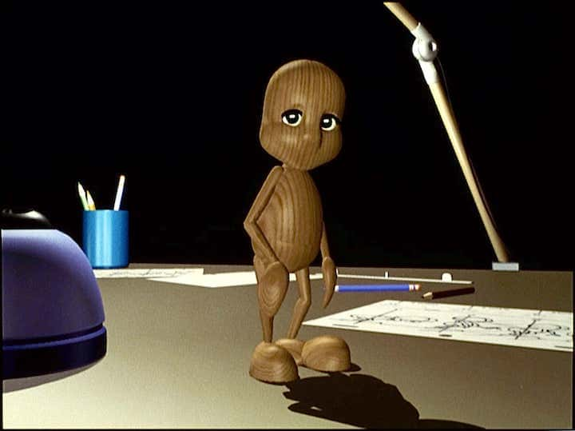

# Fred Website

Animation movie director and professor.

Images and YouTube videos are from Fred Nagorny works.

## How to Use

This site uses a Jekyll version of the "Lens" theme by [HTML5 UP](https://html5up.net/) tuned for a nice images & YouTube integration.

- **GitHub**: Fork this reposity and create a branch named `gh-pages`, then start editing the `_config.yml` file!

### Local installation
‘‘‘ bash
git clone https://github.com/a1rb4Ck/fred_website
git checkout gh-pages
brew install brew-gem
gem install bundler
bundle install
bundle exec jekyll serve
‘‘‘

## Features of the Lens theme by HTML5 UP

Keyboard shortcuts:

	Lens is set up to respond to the following keyboard shortcuts:

	- Left Arrow: Go to previous image.
	- Right Arrow: Go to next image.
	- Up Arrow: Go to image above the current one in the thumbnails section.
	- Down Arrow: Go to image below the current one in the thumbnails section.
	- Space: Go to next image.
	- Escape: Toggle the main wrapper.

	Note: All keyboard shortcuts are disabled when the "xsmall" breakpoint is active
	(since they don't really make a whole lot of sense there).

Other stuff:

	- The main wrapper can be moved to the left by changing the "misc.main-side" variable
		in assets/sass/libs/_vars.scss to "left" (and of course recompiling your CSS).

	- Additional tweakable settings can be found at the top of assets/js/main.js, but
		be aware most of these need to sync with certain Sass variables (see comments
		for details).

Credits:

	Icons:
		Font Awesome (fontawesome.com)

	Other:
		jQuery (jquery.com)
		breakpoints.js (@ajlkn)
		browser.js (@ajlkn)
